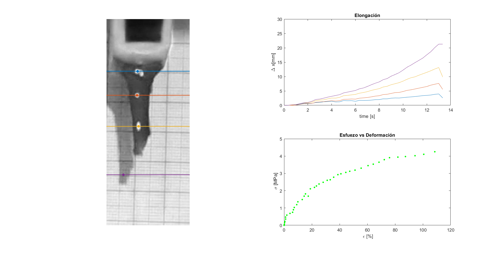

# Procesamiento de imagen de prueba de tensión 
Se desarrolla un script para realizar medición de la deformación experimentada por una probeta de un biopolímero a base de residuos de café desarrollado para la materia de TPI. Para más información visitar la pagina de [CAFEPLÁS](https://tpifibog.wixsite.com/cafeplas)

## Pipeline

* Basado en ```dataExtraction.m``` crear líneas de medición para tabular valores de distancia entre las marcas blancas de la probeta. Crear un video player que permita pasar frame por frame y guardar las mediciones de distancia y fuerza en una tabla ```data.xlsx```. El valor de frames colocados en la tabla es el de video player que tiene una razón de 10:1 respecto al video original.
  
*  Segmentar zona del video donde se realiza la medición, aplicar una mascara binaria, medir centroides de las regiones 
*  Graficar y crear animación con las graficas de esfuerzo deformación y elongación vs tiempo
*  exportar video 


